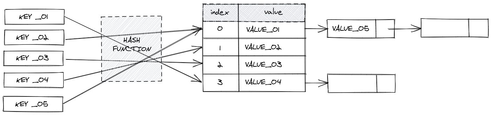

# Hash Table

There are built-in implementations of hash table within languages. For example `Map` object in JavaScript and `Dictionaries` in Python. 

A hash table is used to implement an **associative array** (i.e. a structure that can map keys to values). 

Uses a **hash function** to compute an index into an array of buckets (or slots) - from which the desired value can be found. 

Seach and Insertion for hash tables is run a constant time (O(1))

## Use Cases

 - occurrance/count of each word in a book

## Further Reading 

https://medium.com/javascript-in-plain-english/algorithm-in-javascript-hash-table-7b0464d2b81b
