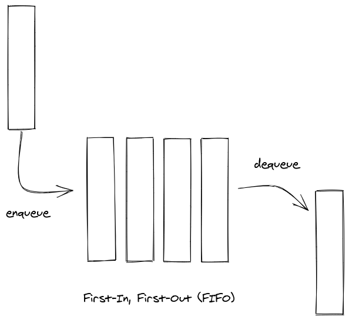

# Queue

## First-In, First-Out

### Use Cases

- when data does not have to be processed immediately but order matters
- Breadth First Search

### Approaches

1. `myQueue.push(elem)` & `myQueue.shift()`
   - this adds element to end of array and removes first element of array
2. `myQueue.unshift(elem)` & `myQueue.pop()`
   - this adds element to front of array and removes last element of array
